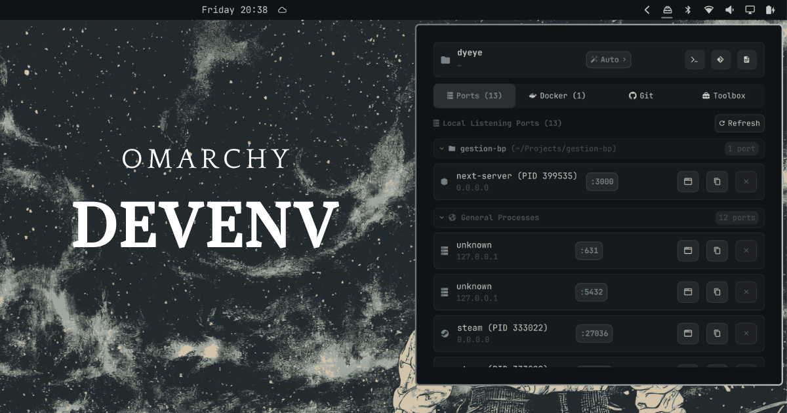
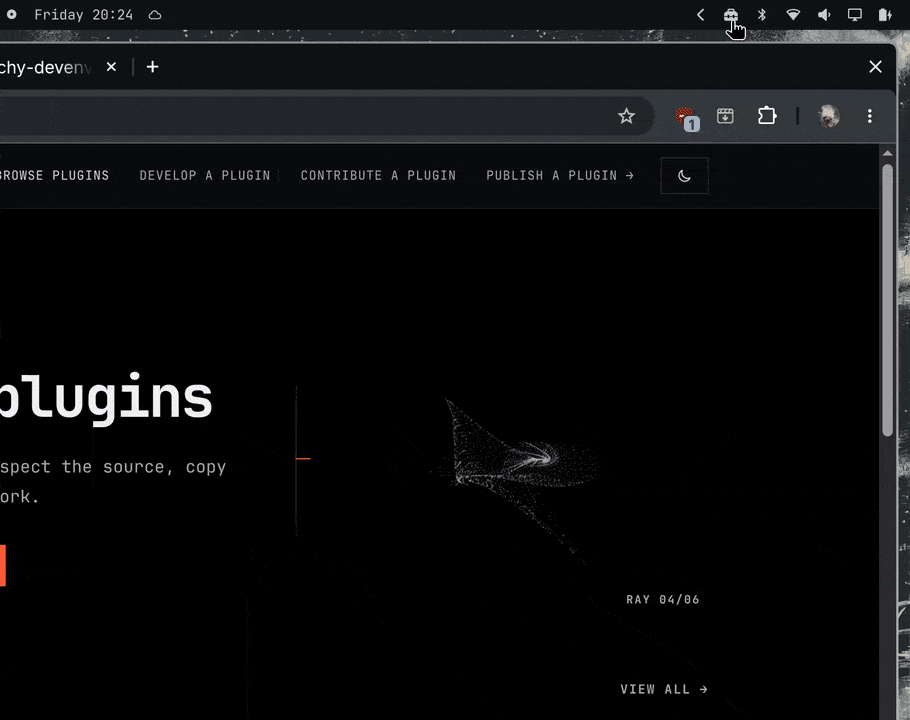

#  Omarchy DevEnv

> Local development mission control for **Omarchy / Hyprland**, built with **Quickshell (QML & JavaScript)**.



Omarchy DevEnv consolidates real-time port inspection, Docker container lifecycle controls, Git repository radar with GitHub integration, and an offline developer toolbox into a native status bar widget and keyboard-driven popout panel.



---

## 󰈚 Architecture & Workflow

Omarchy DevEnv is engineered for sub-50ms latency, reactive state updates, and zero context switching:

1. **Sub-50ms Background Scanner (`helpers/devenv-scan.sh`):** Scans listening TCP sockets (`ss`), local Docker daemon state (`docker ps`), active Git repository status (`git log`, `git status`, `git branch`, `git stash`), GitHub CLI metadata (`gh pr list`, `gh issue list`), and workspace focus in Hyprland.
2. **Reactive Data Layer (`Model.js`):** Ingests and transforms raw JSON into structured reactive models consumed by Qt Quick delegates, featuring zero-allocation path shorteners, date/time formatting, and UUID v4/v7 generators.
3. **Async Action Dispatcher (`helpers/devenv-action.sh`):** Executes non-blocking system actions (port termination, Docker lifecycle, Git checkout, folder picking via `zenity`, and browser launches).
4. **State Isolation (`~/.local/state/omarchy/devenv/`):** User preferences (such as pinned manual projects) are persisted in XDG local state, ensuring modifications never trigger Omarchy plugin reloads.
5. **Native Omarchy Popout Coordinator:** Full integration with the official `bar-widget` popout protocol (`Super + Ctrl + <number>`, `Tab` / `Shift+Tab` panel cycling, and `Escape` dismissal).

---

## 󱥸 Core Features & Tabs

### 1. 󰘵 Project Selector & Discovery (Header)
Seamless switching between auto-detected workspaces and manual project pinning.

* **Auto-Detect Mode (`󰘵 Auto 󰅂`):** Dynamically attaches to the Git repository or workspace directory of the currently focused terminal or editor in Hyprland.
* **Manual Mode (`󰐗 Manual 󰅂`):** Locks the plugin context to a specific repository regardless of window focus.
* **Browse Folder (`󰉋 Browse Folder...`):** Opens a native graphical directory chooser (`zenity`) to select any folder on the system.
* **Automatic Project Discovery:** Scans `~/Projects`, `~/projects`, `~/Workspace`, `~/.config/omarchy/plugins`, and common developer roots to populate a 1-click project selection list.
* **Quick Launchers in Header:**
  *  **Terminal:** Spawns your configured terminal (`ghostty`, `kitty`, `foot`, `alacritty`) at the project root.
  * 󰊢 **Lazygit:** Launches `lazygit` in a floating terminal inside the repository.
  * 󰈙 **Editor:** Opens the project in your configured code editor (`$EDITOR`).
* **Zero Shell Reloads:** Mode switches and project pinning execute entirely in memory and state files without restarting the shell.

---

### 2. 󰒋 Ports & Server Pilot (`PortsTab.qml`)
Detect and manage local development servers and listening sockets.

* **Live TCP Port Discovery:** Monitors all active sockets listening on `127.0.0.1`, `0.0.0.0`, and `::1`.
* **Smart Process Grouping:** Automatically categorizes ports into **Project Ports** (matching the active workspace) and **General Processes** (system/background servers).
* **󰅀 Collapsible General Processes:** Clickable chevron (`󰅀` / `󰅂`) to collapse or expand background sockets, keeping the view clean and compact.
* **Process Search Filter (`󰍉`):** Real-time search bar filtering by port number, process name, or PID.
* **󰐊 Open in Browser:** 1-click launch of `http://localhost:<port>` in your default web browser.
* **󰆏 1-Click Clipboard Copy:** Copies the formatted local URL directly to the Wayland clipboard via `wl-copy`.
* **󰅖 Process Terminator:** Instant `SIGTERM` / `SIGKILL` by PID to free stuck sockets without opening a terminal.

---

### 3.  Docker & Compose Manager (`DockerTab.qml`)
Monitor and control containers and database dependencies without terminal context switches.

* **Container Health Badges:** Real-time state indicators (󰄳 Running, 󰑐 Restarting, 󰅖 Exited).
* **Lifecycle Controls:** Start (`󰐊`), Stop (`󰅖`), and Restart (`󰑐`) actions for individual containers.
* **Interactive Safety Popups:** Yes / No confirmation dialogs before Stop, Restart, and Compose Down actions to prevent accidental downtime.
* **Quick Compose Pilot:** Automatically detects `docker-compose.yml` or `compose.yaml` in the active project directory with 1-click **Compose Up** (`󰐊 Up`) and **Compose Down** (`󰅖 Down`).
* **󰈙 Embedded Logs Viewer:** Inspect recent container stdout/stderr logs and stack traces with a dedicated **Copy Logs** button (`󰆏`).

---

### 4.  Git Radar & GitHub Hub (`GitTab.qml`)
Complete repository tracking, branch switching, and GitHub PR/Issue hub.

* **󰊢 Interactive Branch Switcher:** Active branch pill (`󰊢 <branch> 󰅂`) with an anchored dropdown listing local and remote tracking branches; executes `git checkout` on selection.
* **Status Metrics:** Live counters for Staged (`󰄳 <n> staged`), Modified (`󰈙 <n> modified`), Untracked (`󰋜 <n> untracked`), and Sync state (`󰁝 ahead` / `󰁅 behind`).
* **Sub-Navigation Tabs:**
  * **󰜘 Commits:** Recent commit history with short SHA badge (1-click copy `󰆏`), author, relative time, and smooth marquee scroll on hover for long commit messages.
  * ** Pull Requests:** Active GitHub PRs (`#<number> <title>`) with author info, target branch, and direct browser links.
  * ** Issues:** Open repository issues with author details and browser shortcuts.
  * **󰅖 Stashes:** Stash list with 1-click `Pop` action (`git stash pop`).
* **Quick Launchers:**
  *  **GitHub Web:** Opens the remote repository URL in your default browser.
  * 󰘐 **Lazygit:** Launches `lazygit` in a floating terminal inside the repository.
  *  **Terminal:** Spawns your configured terminal at the project root.
  * 󰈙 **Editor:** Opens the project in your configured code editor.
  * 󰑐 **Fetch:** Synchronizes remote branch tracking with `git fetch`.

---

### 5.  Offline Developer Toolbox (`ToolboxTab.qml`)
Essential micro-tools that work 100% offline with instant Wayland clipboard copy and toast feedback (`󰄳`).

* **`{ }` JSON Tool:**
  * Format with 2 spaces (`󰐊 Format (2s)`) or 4 spaces (`󰐊 Format (4s)`).
  * Minify into a compact single-line string (`󰐊 Minify`).
  * Load sample JSON (`󰈙 Sample`) and Clear buffer (`󰅖 Clear`).
  * Real-time syntax error validation.
* **󱁤 Live Time Dashboard (100% Real-Time):**
  * Live ticking clock updating every second.
  * **Unix Epoch (Seconds):** Hero format with 1-click copy `󰆏`.
  * **Unix Epoch (Milliseconds):** Millisecond precision with 1-click copy `󰆏`.
  * **UTC Date (ISO 8601):** `YYYY-MM-DD HH:mm:ss UTC` with 1-click copy `󰆏`.
  * **Local Formatted Time:** System locale date/time with 1-click copy `󰆏`.
  * **ISO 8601 Full String:** Complete ISO timestamp with 1-click copy `󰆏`.
* **󰻠 Base64 Tool:**
  * Offline UTF-8 Base64 **Encode** (`󰐊 Encode Base64`) and **Decode** (`󰐊 Decode Base64`) with dedicated Clear (`󰅖 Clear`) and Copy (`󰆏 Copy`) actions.
* **󰌠 UUID Generator:**
  * **UUID v4 (Random):** Cryptographically secure random UUIDs (`v4 (Random)`).
  * **UUID v7 (Time-Ordered):** Lexicographically sortable timestamp-based UUIDs (`v7 (Time)`).
  * **Format Controls:** Toggle UPPERCASE (`aA UPPER`) and Hyphens (`- Hyphens`).
  * **Batch Generation:** Generate `1x`, `5x`, or `10x` UUIDs simultaneously.
  * **Copy Actions:** Individual 1-click copy per item (`󰆏`) and `Copy All` button.
  * **Compact Layout:** 2-row non-overflowing design optimized for panel dimensions.

---

## 󰌌 Installation & Configuration

### Prerequisites
* Omarchy Linux with Quickshell
* Hyprland compositor
* Optional tools: `docker`, `git`, `gh` (GitHub CLI), `lazygit`, `ss`, `zenity`, `wl-clipboard`

### 1. Install & Enable
Install and enable the plugin directly using the official Omarchy CLI:

```bash
omarchy plugin add https://github.com/dyeye/omarchy-devenv.git --enable
```

### 2. Removal / Uninstall
To safely remove and uninstall the plugin from Omarchy:

```bash
omarchy plugin remove dyeye.devenv
```

### 3. Keyboard & Mouse Shortcuts

* **Bar Widget Status Icon:** `` (Closed) / `󰦭` (Opened).
* **Mouse Controls:**
  * **Left Click:** Toggles the DevEnv panel.
  * **Right Click:** Triggers an immediate background scan and refresh.
* **Keyboard Navigation:**
  * **`Super + Ctrl + <number>`:** Directly opens DevEnv based on its position in the bar.
  * **`Tab` / `Shift+Tab`:** Cycles to adjacent Omarchy bar popouts.
  * **`Escape`:** Closes the panel.

---

## 󰉋 Project File Hierarchy

```text
~/.config/omarchy/plugins/dyeye.devenv/
├── manifest.json              # Omarchy bar-widget plugin metadata
├── BarWidget.qml              # Status bar pill component ( / 󰦭)
├── Panel.qml                  # Main popout panel with project selector (󰘵 / 󰐗)
├── Model.js                   # Reactive data parsers, formatters & UUID engine
├── LICENSE                    # MIT License
├── README.md                  # Plugin documentation
├── tabs/
│   ├── PortsTab.qml           # TCP port scanner (󰒋), process groups & killer (󰅖)
│   ├── DockerTab.qml          # Containers list (), safe popups & logs drawer (󰈙)
│   ├── GitTab.qml             # Git radar (), branch switcher (󰊢), PRs/Issues & stashes
│   └── ToolboxTab.qml         # Live Time (󱁤), UUID v4/v7 (󰌠), JSON ({ }) & Base64 (󰻠)
└── helpers/
    ├── devenv-scan.sh         # Background scanner for ports, docker, git & gh
    └── devenv-action.sh       # Async runner for docker, git, zenity & wl-copy
```

---

## 󰈚 License

Released under the **MIT License**. Created for Omarchy Linux.
